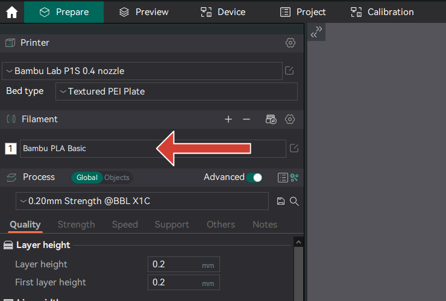
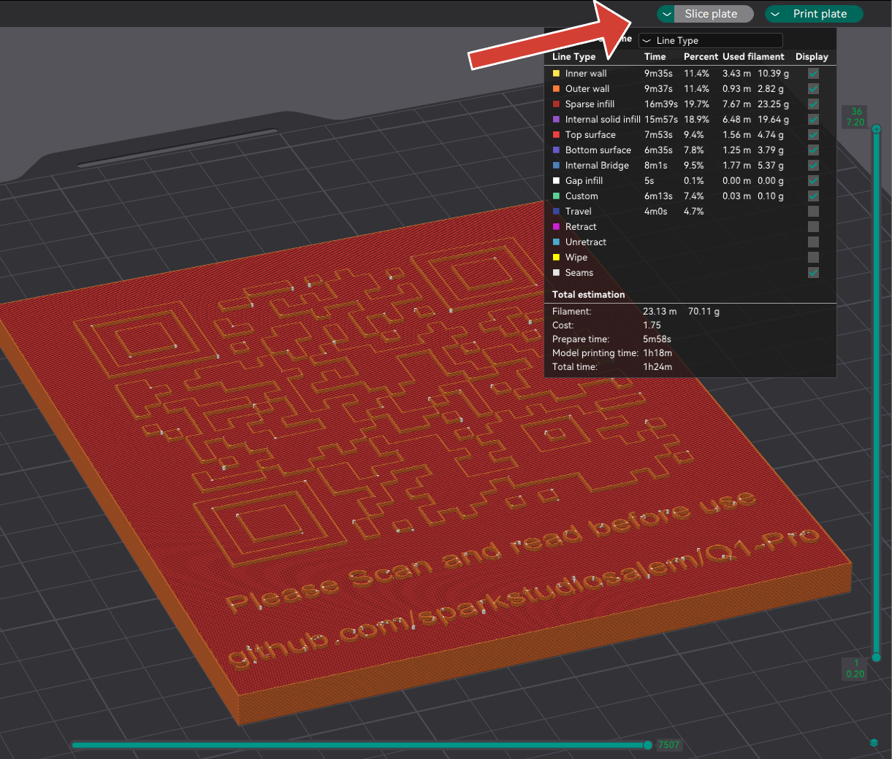
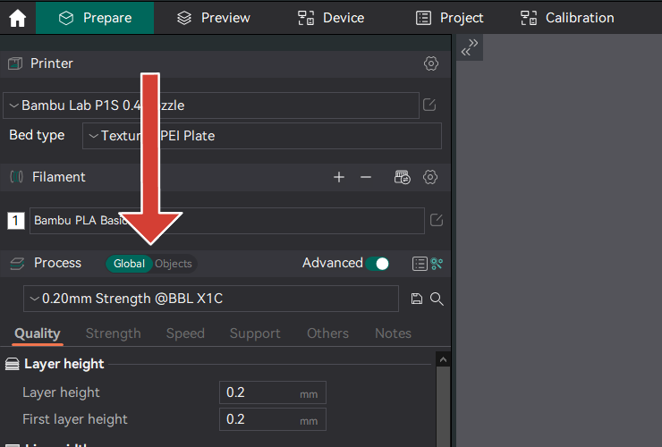
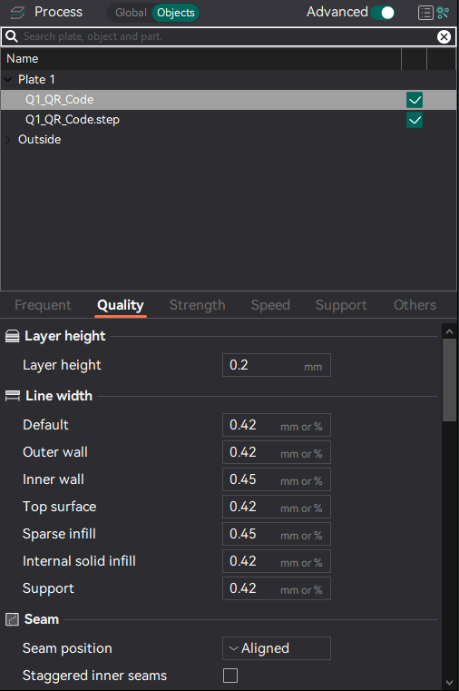

# Orca Slicer

Orca Slicer is an open source fork of Bambu Studio, which originates from Prusa Slicer and Slic3r. It adds some software improvements, slicing algorythm enhancements, and multi-printer feature set, allowing more advanced slicing and native printer control

## Getting Started

Follow these steps to get started with Orca Slicer:

### Installation

* **Download**: Go to the [Orca Slicer GitHub Releases page](https://github.com/SoftFever/OrcaSlicer/releases) and download the appropriate installer for your operating system (Windows, macOS, Linux).

* **Install**: Follow the installation instructions provided with the installer. Orca Slicer comes with an intuitive installation wizard that guides you through the process.

* It is recommended to download the current [Official Release](https://github.com/SoftFever/OrcaSlicer/releases/latest), although they offer [Nightly Builds](https://github.com/SoftFever/OrcaSlicer/releases/tag/nightly-builds) with the latest features, also the latest bugs. The Release Candidate (RC) is also usually available

### Usage

1. Open OrcaSlicer, it can be found on the 3D-Printing Computer near the printers, or you may have elected to install it on your personal computer. The Icon is shown below.

  

1. Select which printer you intend to use from the Printers drop down located on the left top of the prepare tab.

   

1. Select which Filament you intend to use from the Filament drop down located on the left of the prepare tab. The + button is for adding multiple filaments for a multicolor print on capable Printers.

   

1. Select the Printing Profile DropDown, They are usually named by their Layer Height, as well as the specific printing purpose (i.e. Fine, Draft, Strength).

   

1. Import model(s) into the slicer by clicking the Add button on the top of the 3d view window. They can also be dragged in from file explorer or another program. OrcaSlicer accepts stl, Step, and 3mf file formats

   

1. Orient and arrange models automatically with the buttons at the top of the 3d view window. You may also elect to orient models manually by selecting "Lay on Face" and selecting a face of your model. Arrange will automatically arrange one or multiple models on your build plate(s)

  

1. After your Printer, Filament, Profile, and Models have been selected and setup, you can click "Slice Plate" at the top right of the window. This will change to a gcode view of your model and color coded paths for Line Types.
2. The Slider on the right can be dragged up and down to show each layer line by line.

1. You may access the selected printer's web interface by selecting the devide tab along the top of the window. For OctoPrint and Klipper this will just mirror what the browser view shows, allowing for easy configuration and printer monitoring.

1. Paramaters can be different for each model imported. The selector switch is labeled "Global/Objects" shown below. Selecting "Objects" allows you to change individual settings for each model (i.e. infill percentage, wall counts, layer height, etc.)

Selecting each model by name presents the available settings for each. Best practice is to select a printing profile to start with before you select the "Objects" tab.

1. For users looking for more in-depth settings, they may choose to turn on "Advanced" settings just to the right of the Global / Objects Selector. It will add new settings tabs, as well as populate more settings in each.

### Resources

- **Documentation**: Refer to the [official documentation](https://orca-docs.readthedocs.io/en/latest/) for detailed information on how to use Orca Slicer effectively.
  
- **Tutorials**: Explore tutorials and guides available on the [Orca Slicer website](https://orca.medphys.ucl.ac.uk/tutorials/) to learn more about specific features and workflows.

- **Community**: Join the [Orca Slicer community forum](https://discourse.slicer.org/) to connect with other users, ask questions, and share your experiences.

### Contributing

Contributions to Orca Slicer are welcome! Whether you want to report a bug, suggest a new feature, or contribute code, please refer to the [contribution guidelines](CONTRIBUTING.md) for more information.

## License

Orca Slicer is distributed under the [BSD 3-Clause License](LICENSE). Please review the license terms before using Orca Slicer in your projects.

## Support

For any questions, issues, or feedback, please [open an issue](https://github.com/OrcaSlicer/Orca/issues) on GitHub. Our team will be happy to assist you!
